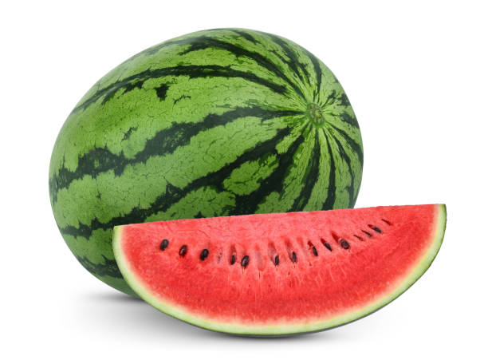

# K Means Clustering
This code create clusters based on colors using the K-Means Clustering Algorithm

## Description

We are tasked with segmenting an image using the K-means algorithm. Our goal is to assign each pixel in the image to one of several clusters based on the similarity of their color values. We rely solely on basic numpy operations for matrix manipulation and avoid using any built-in functions.

To begin, we initialize the cluster centers by selecting starting positions. Then, we create a copy of the image and introduce an additional channel to represent the cluster assignment for each pixel. This fourth channel encodes which cluster the pixel belongs to.

Next, we iterate through each pixel in the image and calculate the difference between its BGR values and those of the cluster centers. Based on the smallest difference, we assign the pixel to the closest cluster. This process continues until the cluster centers no longer shift between iterations, serving as our termination condition for the loop.

During each iteration, if the distance in the BGR channels to a different cluster 'k' is lower, indicating closer proximity, we reassign the pixel to that cluster. This update ensures accurate clustering of the points.

Finally, we compute the average BGR values for all pixels assigned to each cluster and designate these averages as the new cluster centers. This iterative process continues until there is no further shift in the cluster centers, indicating convergence.


## Folder Structure:
```
K_Means_Clustering
+-Media
  +-image.png
+-Results
  +-Kmean_1_cluster.jpg
  +-Kmean_2_cluster.jpg
  +-Kmean_3_cluster.jpg
  +-Kmean_4_cluster.jpg
  +-result.jpg
+-README.md
+-k_means_clustering.py
```
## Usage
```
python3 k_means_clustering.py
```
## Results

<table>
 <tr>
   <td><p align='center'> Original Image </p></td>
   <td><p align='center'> Cluster 1 </p></td>
 </tr>
 <tr>
   <td><p align='center'> Cluster 2 </p></td>
   <td><p align='center'> Cluster 3 </p></td>
 </tr>
 <tr>
   <td><p align='center'> Cluster 4 </p></td>
   <td><p align='center'> Result </p></td>
 </tr>
</table>
